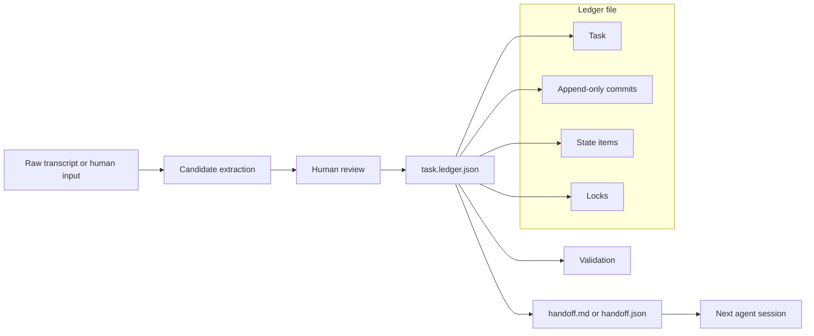

# Stateframe Architecture

Stateframe is a file-first task-state ledger for long-horizon agent workflows. The core product surface is a portable `task.ledger.json` file plus generated handoff packets that another agent can inspect before continuing work.

## System Shape

## Core Data Flow

1. A task starts with a title, objective, and domain.
2. Humans or extraction providers add candidate state items such as decisions, rejected options, blockers, assumptions, and next steps.
3. Review promotes useful candidates into the ledger.
4. Commits preserve how state changed over time.
5. Locks mark which state is trusted enough to include in a handoff packet.
6. Validation checks the file shape, references, item status logic, and handoff generation.
7. A generated handoff packet gives the next agent the compact current-state view.

## Why File-First

The local file is the source of truth because long-running agent work often moves across tools, repositories, and chat sessions. A file can travel with the project, be reviewed in Git, attached to an issue, or passed to a different agent runtime without requiring hosted infrastructure.

## Boundaries

- Stateframe does not try to be long-term memory. It tracks task state, not user facts or preferences.
- Stateframe does not replace traces. Traces explain what happened; the ledger explains what matters now.
- Stateframe does not orchestrate agents. It provides durable state that orchestrators and humans can inspect.

## Current Surfaces

- CLI commands for creating, editing, validating, and exporting a local ledger.
- JSON Schema for the ledger file format.
- Optional provider-backed extraction from transcripts.
- Example long-horizon coding workflow with a generated handoff packet.
